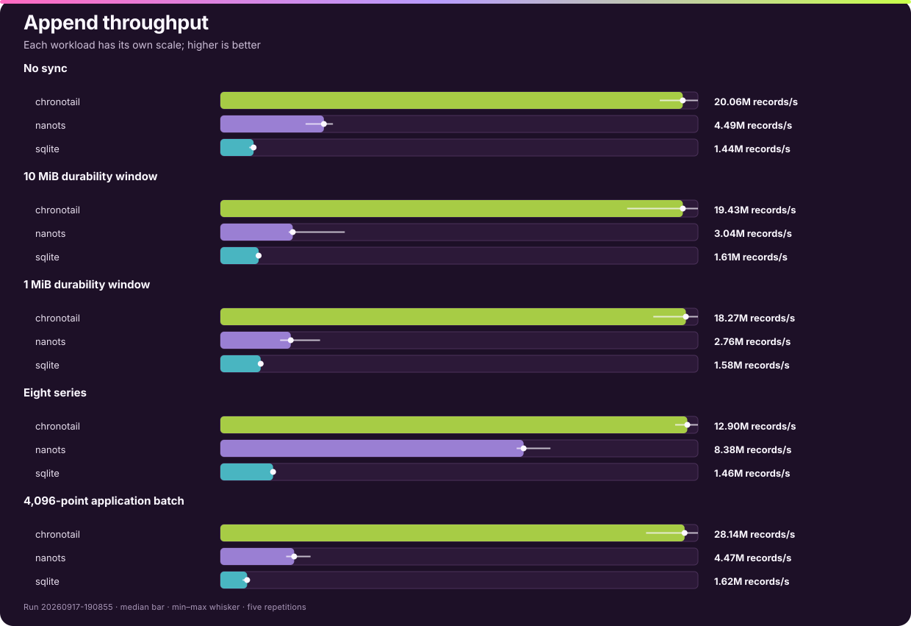
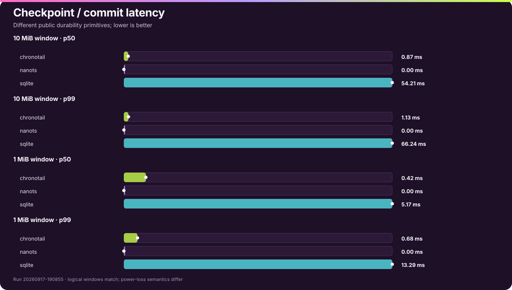
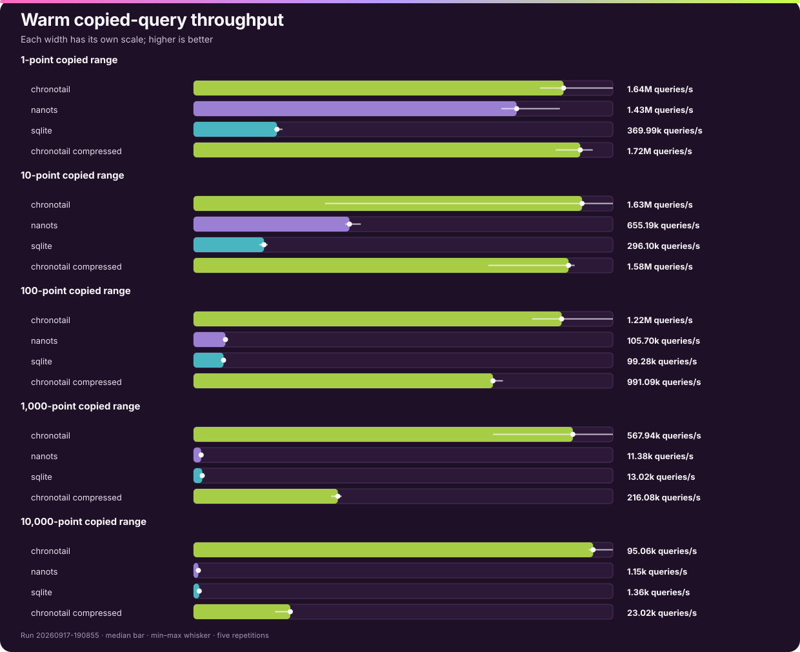
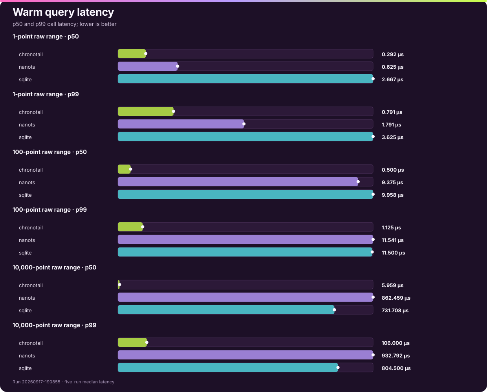
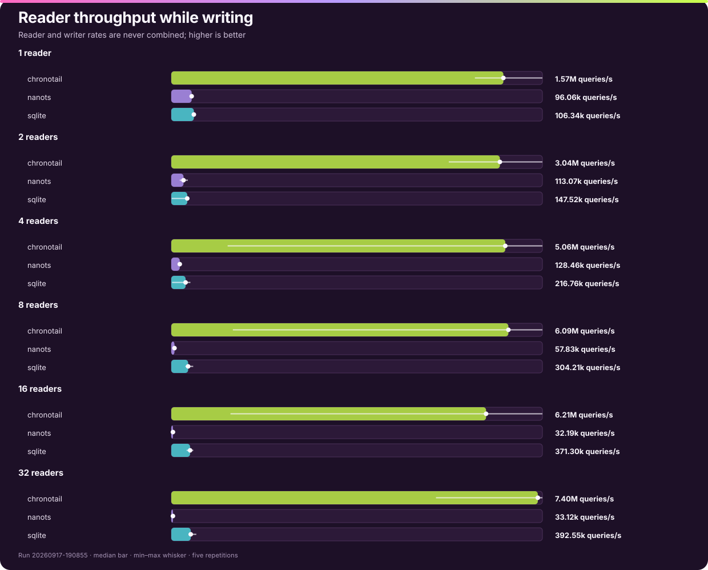
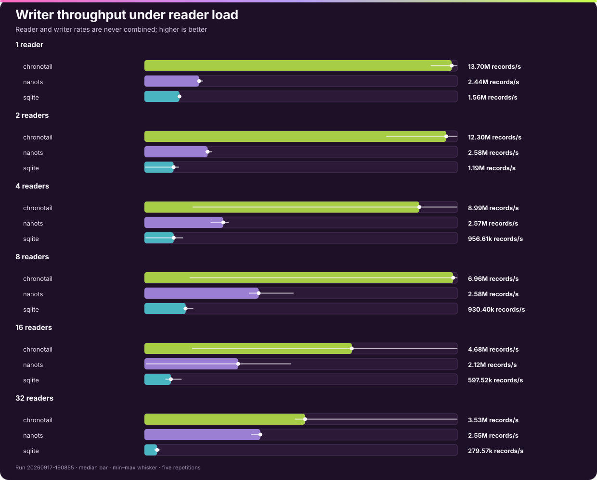
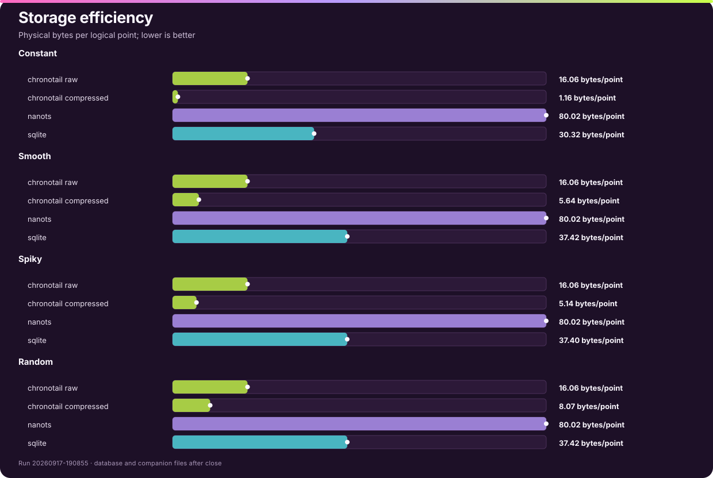

# Chronotail competitive benchmarks

> Current format-v7 / C-ABI-v2 evidence. Run `20260917-190855` contains 495 measurements across 99 engine/workload groups and five repetitions.


## Result in one minute

- **Batch append:** 28.14M records/s; 6.29× NanoTS, 17.36× SQLite under the no-sync workload.
- **Random point lookup:** 1.64M queries/s; 1.15× NanoTS, 4.44× SQLite.
- **Raw 100-point range:** 1.22M queries/s; 11.53× NanoTS, 12.27× SQLite.
- **Raw 100-point aggregate:** 355.31k queries/s; 3.37× NanoTS, 4.46× SQLite.
- **32-reader throughput while writing:** 7.40M queries/s; 223.33× NanoTS, 18.84× SQLite.
- **Compressed smooth storage:** 5.644 bytes/point.

These are same-run comparisons, not copied vendor numbers. Raw records are in [`raw.jsonl`](bench/results/20260917-190855/raw.jsonl), exact medians and run ranges are in [`summary.csv`](bench/results/20260917-190855/summary.csv), the workload identity contract is in [`matrix.json`](bench/results/20260917-190855/matrix.json), and every command is in [`commands.log`](bench/results/20260917-190855/commands.log).

## Test machine

| Item | Value |
|---|---|
| CPU | Apple M1 (8 logical CPUs) |
| RAM | 8 GiB |
| OS | macOS 26.1 / arm64 |
| Filesystem | APFS, local internal SSD |
| Zig | 0.15.2 |
| Clang | Apple clang version 17.0.0 (clang-1700.3.19.1) |
| NanoTS | commit `d551210c8d521604a70a73f0f85fe2759c434c23` |
| SQLite | 3.38.5, NanoTS vendored amalgamation |
| Repetitions | 5; all tables report medians and min–max run ranges |

## Append



| Workload | Engine | Throughput | Run range | p50 | p95 | p99 |
|---|---|---:|---:|---:|---:|---:|
| `append-A-none` | chronotail | 20.06M/s | 19.06M–20.71M/s | 0.041 µs | 0.042 µs | 0.042 µs |
| `append-A-none` | nanots | 4.49M/s | 3.69M–4.88M/s | 0.041 µs | 0.042 µs | 0.084 µs |
| `append-A-none` | sqlite | 1.44M/s | 1.25M–1.51M/s | 0.500 µs | 0.584 µs | 2.292 µs |
| `append-B-10MiB` | chronotail | 19.43M/s | 17.09M–20.06M/s | 0.041 µs | 0.042 µs | 0.042 µs |
| `append-B-10MiB` | nanots | 3.04M/s | 2.87M–5.23M/s | 0.041 µs | 0.042 µs | 0.125 µs |
| `append-B-10MiB` | sqlite | 1.61M/s | 1.59M–1.64M/s | 0.500 µs | 0.583 µs | 1.750 µs |
| `append-C-1MiB` | chronotail | 18.27M/s | 16.99M–18.74M/s | 0.041 µs | 0.042 µs | 0.042 µs |
| `append-C-1MiB` | nanots | 2.76M/s | 2.34M–3.91M/s | 0.041 µs | 0.042 µs | 0.125 µs |
| `append-C-1MiB` | sqlite | 1.58M/s | 1.56M–1.66M/s | 0.500 µs | 0.583 µs | 1.792 µs |
| `append-8-series` | chronotail | 12.90M/s | 12.57M–13.20M/s | 0.042 µs | 0.083 µs | 0.084 µs |
| `append-8-series` | nanots | 8.38M/s | 8.19M–9.12M/s | 0.042 µs | 0.042 µs | 0.083 µs |
| `append-8-series` | sqlite | 1.46M/s | 1.43M–1.50M/s | 0.500 µs | 1.334 µs | 2.292 µs |
| `append-batch-4096` | chronotail | 28.14M/s | 25.80M–28.95M/s | 107.917 µs | 191.584 µs | 277.417 µs |
| `append-batch-4096` | nanots | 4.47M/s | 3.98M–5.46M/s | 0.041 µs | 0.042 µs | 0.125 µs |
| `append-batch-4096` | sqlite | 1.62M/s | 1.35M–1.64M/s | 0.500 µs | 0.584 µs | 2.291 µs |

The 4,096-point batch row uses each engine's best available public ingestion path: Chronotail submits one batch, while NanoTS and SQLite expose record-at-a-time calls inside their existing writer/transaction context. Batch-call latency is therefore not compared across engines; throughput is.

No multiplier is claimed for the durability-window rows. Chronotail publishes with `fsync`, NanoTS rollover uses synchronous `msync`, and SQLite uses WAL with `synchronous=FULL`. The logical windows match; macOS does not promise identical power-loss semantics for those primitives.



## Copied queries



| Workload | Engine | Throughput | Run range | p50 | p95 | p99 |
|---|---|---:|---:|---:|---:|---:|
| `point-lookup-warm` | chronotail | 1.64M/s | 1.54M–1.86M/s | 0.292 µs | 0.625 µs | 0.791 µs |
| `point-lookup-warm` | nanots | 1.43M/s | 1.36M–1.62M/s | 0.625 µs | 1.000 µs | 1.791 µs |
| `point-lookup-warm` | sqlite | 369.99k/s | 359.37k–394.54k/s | 2.667 µs | 3.083 µs | 3.625 µs |
| `point-lookup-compressed-warm` | chronotail | 1.72M/s | 1.61M–1.77M/s | 0.375 µs | 0.625 µs | 0.709 µs |
| `range-10-raw-warm` | chronotail | 1.63M/s | 552.28k–1.76M/s | 0.333 µs | 0.542 µs | 0.709 µs |
| `range-10-raw-warm` | nanots | 655.19k/s | 637.97k–703.20k/s | 1.458 µs | 1.875 µs | 2.916 µs |
| `range-10-raw-warm` | sqlite | 296.10k/s | 276.74k–311.63k/s | 3.334 µs | 3.709 µs | 4.208 µs |
| `range-10-compressed-warm` | chronotail | 1.58M/s | 1.24M–1.60M/s | 0.417 µs | 0.667 µs | 0.791 µs |
| `range-100-raw-warm` | chronotail | 1.22M/s | 1.12M–1.39M/s | 0.500 µs | 0.833 µs | 1.125 µs |
| `range-100-raw-warm` | nanots | 105.70k/s | 101.68k–108.98k/s | 9.375 µs | 10.083 µs | 11.541 µs |
| `range-100-raw-warm` | sqlite | 99.28k/s | 97.99k–103.64k/s | 9.958 µs | 10.667 µs | 11.500 µs |
| `range-100-compressed-warm` | chronotail | 991.09k/s | 984.62k–1.02M/s | 0.792 µs | 1.042 µs | 1.167 µs |
| `range-1000-raw-warm` | chronotail | 567.94k/s | 448.32k–627.93k/s | 1.375 µs | 1.875 µs | 2.209 µs |
| `range-1000-raw-warm` | nanots | 11.38k/s | 11.17k–11.73k/s | 86.917 µs | 91.709 µs | 101.500 µs |
| `range-1000-raw-warm` | sqlite | 13.02k/s | 12.35k–13.42k/s | 76.083 µs | 80.625 µs | 91.875 µs |
| `range-1000-compressed-warm` | chronotail | 216.08k/s | 206.03k–221.73k/s | 4.292 µs | 4.667 µs | 4.916 µs |
| `range-10000-raw-warm` | chronotail | 95.06k/s | 94.01k–99.76k/s | 5.959 µs | 7.042 µs | 106.000 µs |
| `range-10000-raw-warm` | nanots | 1.15k/s | 1.14k–1.18k/s | 862.459 µs | 899.917 µs | 932.792 µs |
| `range-10000-raw-warm` | sqlite | 1.36k/s | 1.29k–1.40k/s | 731.708 µs | 771.208 µs | 804.500 µs |
| `range-10000-compressed-warm` | chronotail | 23.02k/s | 19.39k–23.48k/s | 39.208 µs | 41.916 µs | 106.292 µs |



Raw rows are equivalent cross-engine workloads. Chronotail compressed rows are an internal storage/CPU choice and are never used to compute competitor ratios. Queries use deterministic random starts against a one-million-point database in the warm OS page cache.

## Aggregates


| Workload | Engine | Throughput | Run range | p50 | p95 | p99 |
|---|---|---:|---:|---:|---:|---:|
| `aggregate-100-raw-warm` | chronotail | 355.31k/s | 259.71k–401.83k/s | 2.458 µs | 3.125 µs | 3.625 µs |
| `aggregate-100-raw-warm` | nanots | 105.42k/s | 82.42k–108.70k/s | 9.375 µs | 10.125 µs | 11.708 µs |
| `aggregate-100-raw-warm` | sqlite | 79.75k/s | 63.09k–82.54k/s | 11.833 µs | 12.625 µs | 13.459 µs |
| `aggregate-100-compressed-warm` | chronotail | 352.38k/s | 229.15k–365.50k/s | 2.584 µs | 3.084 µs | 3.500 µs |
| `aggregate-10000-raw-warm` | chronotail | 77.41k/s | 76.82k–80.53k/s | 13.375 µs | 14.708 µs | 115.750 µs |
| `aggregate-10000-raw-warm` | nanots | 1.15k/s | 1.10k–1.18k/s | 862.875 µs | 902.541 µs | 945.250 µs |
| `aggregate-10000-raw-warm` | sqlite | 1.21k/s | 1.17k–1.23k/s | 824.625 µs | 861.041 µs | 887.375 µs |
| `aggregate-10000-compressed-warm` | chronotail | 47.27k/s | 43.39k–48.51k/s | 26.042 µs | 28.083 µs | 97.750 µs |
| `aggregate-full-raw-warm` | chronotail | 13.87M/s | 10.34M–15.29M/s | 0.041 µs | 0.042 µs | 0.042 µs |
| `aggregate-full-raw-warm` | nanots | 11.53/s | 11.48–11.77/s | 86.34 ms | 87.15 ms | 91.62 ms |
| `aggregate-full-raw-warm` | sqlite | 11.92/s | 0.58–12.24/s | 82.91 ms | 86.79 ms | 93.34 ms |
| `aggregate-full-compressed-warm` | chronotail | 15.09M/s | 11.88M–15.59M/s | 0.000 µs | 0.042 µs | 0.042 µs |

Every engine computes count, minimum, maximum, sum, first, and last over the same inclusive range. Chronotail uses its public persisted-summary API, SQLite uses public SQL aggregates plus indexed first/last subqueries, and NanoTS scans its public iterator.

The full-series rows execute 100 calls so the scanning engines remain practical. Chronotail answers that case from a persisted series summary, making its measured interval only a few microseconds and therefore sensitive to timer and loop overhead. Treat those rows as evidence of the bounded summary path, not as a hardware-throughput headline; the overview uses the 100-point aggregate measured over 100,000 calls.

## Concurrent readers and writer





| Readers | Engine | Writer records/s | Reader queries/s | Reader p50 | Reader p99 |
|---:|---|---:|---:|---:|---:|
| 1 | chronotail | 13.70M | 1.57M | 0.542 µs | 1.084 µs |
| 1 | nanots | 2.44M | 96.06k | 9.792 µs | 14.375 µs |
| 1 | sqlite | 1.56M | 106.34k | 8.959 µs | 12.709 µs |
| 2 | chronotail | 12.30M | 3.04M | 0.541 µs | 1.250 µs |
| 2 | nanots | 2.58M | 113.07k | 16.333 µs | 25.625 µs |
| 2 | sqlite | 1.19M | 147.52k | 9.583 µs | 14.000 µs |
| 4 | chronotail | 8.99M | 5.06M | 0.541 µs | 1.625 µs |
| 4 | nanots | 2.57M | 128.46k | 26.958 µs | 135.041 µs |
| 4 | sqlite | 956.61k | 216.76k | 9.125 µs | 34.375 µs |
| 8 | chronotail | 6.96M | 6.09M | 0.625 µs | 1.667 µs |
| 8 | nanots | 2.58M | 57.83k | 112.250 µs | 428.083 µs |
| 8 | sqlite | 930.40k | 304.21k | 12.417 µs | 103.333 µs |
| 16 | chronotail | 4.68M | 6.21M | 0.584 µs | 1.625 µs |
| 16 | nanots | 2.12M | 32.19k | 245.833 µs | 2.05 ms |
| 16 | sqlite | 597.52k | 371.30k | 10.791 µs | 276.334 µs |
| 32 | chronotail | 3.53M | 7.40M | 0.584 µs | 1.667 µs |
| 32 | nanots | 2.55M | 33.12k | 356.917 µs | 3.98 ms |
| 32 | sqlite | 279.57k | 392.55k | 13.875 µs | 773.125 µs |

Writer and reader rates are deliberately separate. Readers query the fixed initial one-million-point snapshot while the writer appends and durably publishes around 1 MiB logical boundaries. This avoids rewarding an engine for exposing uncommitted tail points.

## Storage



| Pattern | Engine/mode | Total size | Bytes/point |
|---|---|---:|---:|
| constant | Chronotail raw | 153.20 MiB | 16.064 |
| constant | Chronotail compressed | 11.02 MiB | 1.156 |
| constant | NanoTS | 763.10 MiB | 80.017 |
| constant | SQLite | 289.14 MiB | 30.319 |
| smooth | Chronotail raw | 153.20 MiB | 16.064 |
| smooth | Chronotail compressed | 53.82 MiB | 5.644 |
| smooth | NanoTS | 763.10 MiB | 80.017 |
| smooth | SQLite | 356.87 MiB | 37.421 |
| spiky | Chronotail raw | 153.20 MiB | 16.064 |
| spiky | Chronotail compressed | 49.01 MiB | 5.140 |
| spiky | NanoTS | 763.10 MiB | 80.017 |
| spiky | SQLite | 356.70 MiB | 37.403 |
| random | Chronotail raw | 153.20 MiB | 16.064 |
| random | Chronotail compressed | 76.94 MiB | 8.068 |
| random | NanoTS | 763.10 MiB | 80.017 |
| random | SQLite | 356.87 MiB | 37.421 |

Physical size includes persistent companion/catalog files whose basename begins with the database name. NanoTS preallocation matches the calculated capacity; SQLite is checkpointed and closed before measurement.

## Where Chronotail loses

Chronotail has no measured loss in the comparable query, aggregate, or concurrency workloads.

This section is generated from every comparable query, aggregate, and concurrent reader/writer group. It is intentionally not a winner-only summary.

## Run variability

The SVG whiskers show min–max rates around the five-run median. The widest relative spreads were:

| Workload | Engine | Worst | Median | Best | Best–worst / median |
|---|---|---:|---:|---:|---:|
| `concurrent-16-readers` | nanots | 600.24/s | 32.19k/s | 73.63k/s | 226.8% |
| `concurrent-16-writer` | nanots | 33.90k/s | 2.12M/s | 3.31M/s | 154.7% |
| `concurrent-4-readers` | sqlite | 12.37k/s | 216.76k/s | 289.70k/s | 127.9% |
| `concurrent-4-writer` | sqlite | 37.65k/s | 956.61k/s | 1.26M/s | 127.9% |
| `concurrent-16-writer` | chronotail | 1.08M/s | 4.68M/s | 7.07M/s | 127.9% |
| `concurrent-2-writer` | sqlite | 28.85k/s | 1.19M/s | 1.41M/s | 116.1% |
| `concurrent-2-readers` | sqlite | 3.49k/s | 147.52k/s | 164.40k/s | 109.1% |
| `concurrent-32-writer` | chronotail | 3.31M/s | 3.53M/s | 6.89M/s | 101.1% |

Run-to-run spread is evidence about the host as well as the engine. Same-run ratios are more reliable than comparing these absolute rates with older runs taken under different background load.

## Methodology and limits

- Logical point: exactly 16 bytes (`i64` timestamp plus `f64` value).
- All engines use optimized local builds, deterministic data, deterministic query seeds, public APIs, consumed results, and complete database validation.
- The original 45-group suite runs first and unchanged; expanded workloads run afterward. Engine order rotates by repetition for the comparable append, query, aggregate, and concurrency loops.
- Query setup and process startup are outside timing. Queries use the warm OS page cache. Cold-cache numbers are omitted because reliable eviction on this macOS host requires privileged global `purge`.
- Append latency uses deterministic randomized sampling averaging one in 1,024 records. Query and aggregate latency times every call. Concurrent readers sample every 256th aggregate query.
- Historical query latency has an unavoidable sink asymmetry: Chronotail materializes caller buffers inside the bracket and hashes them after it, while NanoTS/SQLite consume iterator/row values inside the bracket. Total throughput includes consumption for every engine.
- Append setup is not perfectly symmetric: Chronotail open and NanoTS allocation occur before timing, while SQLite open/schema creation is inside its append interval. This is retained and disclosed so the original public workloads remain comparable with the archived baseline.
- Competitor winners do not drive production tuning. Internal profiling and safety gates remain separate from public evidence.

## Reproduce

```bash
python3 bench/competitive/bench.py run --publish
```

Resume an interrupted run with the same source and machine fingerprint:

```bash
python3 bench/competitive/bench.py run \
  --resume bench/results/20260917-190855 \
  --publish
```

Regenerate and explicitly publish an already-complete run:

```bash
python3 bench/competitive/bench.py report \
  bench/results/20260917-190855 \
  --publish
```

The tool fetches the pinned NanoTS commit, builds all engines, validates the exact matrix before publication, and emits only dependency-free SVG charts.
