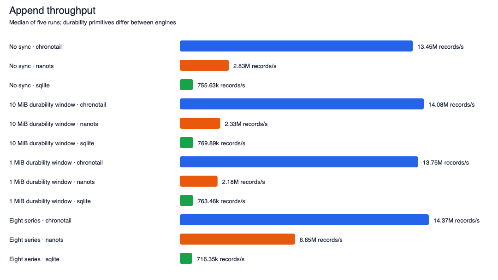
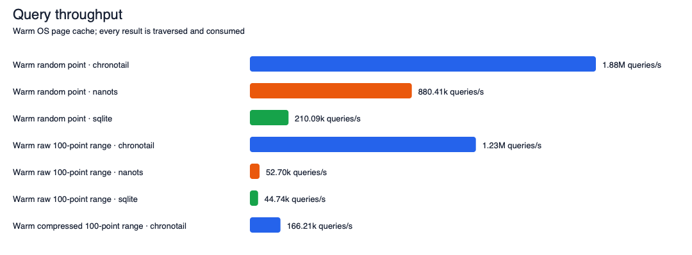
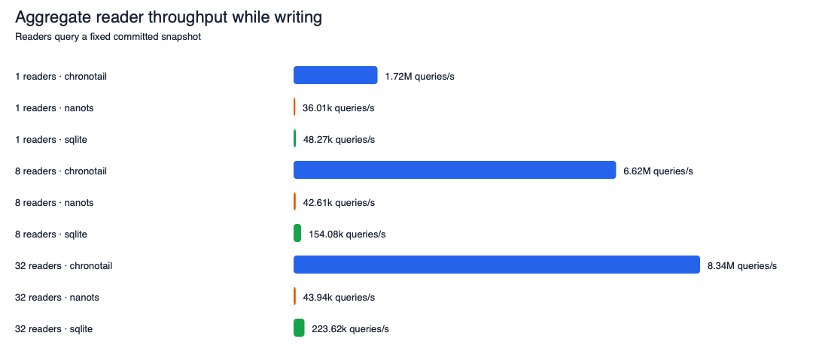
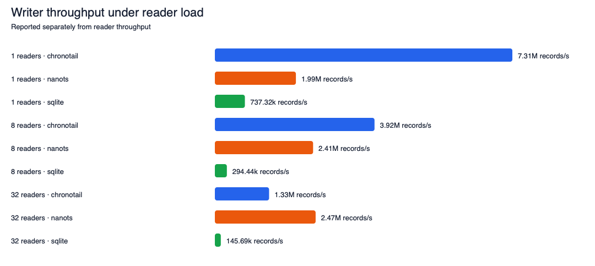
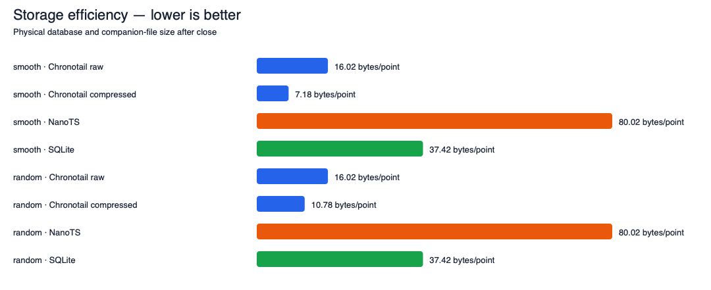

# Chronotail competitive benchmarks

These are measured results, not copied vendor numbers. Raw output is in [`bench/results/20260917-105244/raw.jsonl`](bench/results/20260917-105244/raw.jsonl), the aggregate CSV is in [`summary.csv`](bench/results/20260917-105244/summary.csv), and every invocation is in [`commands.log`](bench/results/20260917-105244/commands.log).

The TigerStyle mechanical model, architectural analysis, experiments, and safety evidence are in [`bench/results/tigerstyle/REPORT.md`](bench/results/tigerstyle/REPORT.md). The preceding profiler-guided pass remains archived under `bench/results/performance-pass/`.

> **Run-quality note:** unrelated Python test processes, OrbStack, and desktop processes heavily loaded the host during this run. The unchanged methodology and same-run competitor ratios remain useful, but absolute rates are not a clean comparison with earlier runs. Alternating same-host A/B diagnostics are reported separately in the TigerStyle report.

## Test machine

| Item | Value |
|---|---|
| CPU | Apple M1 (8 logical CPUs) |
| RAM | 8 GiB |
| OS | macOS 26.1 / arm64 |
| Filesystem | APFS, local internal SSD |
| Zig | 0.15.2 |
| Clang | Apple clang version 17.0.0 (clang-1700.3.19.1) |
| NanoTS | commit `d551210c8d521604a70a73f0f85fe2759c434c23` |
| SQLite | 3.38.5, NanoTS vendored amalgamation |
| Repetitions | 5; tables report medians |

All binaries use optimized release builds. Every engine receives the same deterministic `(i64 timestamp, f64 value)` points. All output is consumed and every database is fully scanned and checked after each workload. Databases are deleted between runs. Query results are warm OS-page-cache results; privileged global cache purging was not used.

## 1. Single-series sustained append

| Workload | Engine | Throughput | Logical MiB/s | p50 | p99 | File |
|---|---:|---:|---:|---:|---:|---:|
| append-A-none | chronotail | 13.45M/s | 205.18 | 0.042 µs | 0.084 µs | 152.78 MiB |
| append-A-none | nanots | 2.83M/s | 43.15 | 0.042 µs | 0.125 µs | 763.10 MiB |
| append-A-none | sqlite | 755.63k/s | 11.53 | 1.000 µs | 5.584 µs | 356.87 MiB |
| append-B-10MiB | chronotail | 14.08M/s | 214.89 | 0.042 µs | 0.084 µs | 152.78 MiB |
| append-B-10MiB | nanots | 2.33M/s | 35.54 | 0.042 µs | 0.125 µs | 801.10 MiB |
| append-B-10MiB | sqlite | 769.89k/s | 11.75 | 1.000 µs | 3.833 µs | 356.87 MiB |
| append-C-1MiB | chronotail | 13.75M/s | 209.85 | 0.042 µs | 0.084 µs | 152.90 MiB |
| append-C-1MiB | nanots | 2.18M/s | 33.21 | 0.042 µs | 0.125 µs | 774.68 MiB |
| append-C-1MiB | sqlite | 763.46k/s | 11.65 | 0.917 µs | 4.125 µs | 356.87 MiB |



No cross-engine multiplier is claimed for append durability workloads. The logical durability windows match, but the public persistence primitives do not.

Durability caveat: Chronotail uses `checkpoint(fsync=true)` and SQLite commits a WAL transaction with `synchronous=FULL`. NanoTS has no public explicit checkpoint API; its block rollover performs synchronous `msync`, so its block capacity is calculated as exactly the requested number of 16-byte logical payloads. These are the closest public semantics, but macOS does not guarantee that `msync(MS_SYNC)`, `fsync`, and SQLite WAL FULL have identical power-loss behavior. The tables compare the requested logical windows, not identical persistence primitives.

## 2. Eight-series append

| Workload | Engine | Throughput | Logical MiB/s | p50 | p99 | File |
|---|---:|---:|---:|---:|---:|---:|
| append-8-series | chronotail | 14.37M/s | 219.29 | 0.042 µs | 0.084 µs | 15.28 MiB |
| append-8-series | nanots | 6.65M/s | 101.46 | 0.042 µs | 0.125 µs | 101.10 MiB |
| append-8-series | sqlite | 716.35k/s | 10.93 | 0.958 µs | 4.791 µs | 34.75 MiB |

No multiplier is claimed here because the engines expose different durability primitives.

One application thread feeds eight series round-robin. NanoTS block capacities are divided by eight so the aggregate logical durability window remains approximately 10 MiB.

## 3. Random point lookup

| Workload | Engine | Throughput | Logical MiB/s | p50 | p99 | File |
|---|---:|---:|---:|---:|---:|---:|
| point-lookup-warm | chronotail | 1.88M/s | 28.71 | 0.125 µs | 0.333 µs | 15.28 MiB |
| point-lookup-warm | nanots | 880.41k/s | 13.43 | 1.042 µs | 3.000 µs | 81.13 MiB |
| point-lookup-warm | sqlite | 210.09k/s | 3.21 | 4.542 µs | 7.041 µs | 34.30 MiB |

- Chronotail: **2.14× NanoTS**
- Chronotail: **8.96× SQLite**

Cold-cache numbers are intentionally omitted: reliable cache eviction on this macOS host requires a privileged system-wide `purge`, which would make unattended runs intrusive and less reproducible.

## 4. 100-point range query

| Workload | Engine | Throughput | Logical MiB/s | p50 | p99 | File |
|---|---:|---:|---:|---:|---:|---:|
| range-100-raw-warm | chronotail | 1.23M/s | 1875.02 | 0.375 µs | 0.792 µs | 15.28 MiB |
| range-100-raw-warm | nanots | 52.70k/s | 80.41 | 17.000 µs | 32.209 µs | 81.13 MiB |
| range-100-raw-warm | sqlite | 44.74k/s | 68.26 | 20.667 µs | 51.459 µs | 34.30 MiB |
| range-100-compressed-warm | chronotail | 166.21k/s | 253.62 | 5.625 µs | 8.916 µs | 6.85 MiB |



Raw equivalent-workload ratios:

- Chronotail: **23.32× NanoTS**
- Chronotail: **27.47× SQLite**

Chronotail compressed is shown separately and is not used for ratios against raw NanoTS or SQLite.

## Where Chronotail loses

Measured cross-engine throughput losses:

- `concurrent-32-writer`: nanots is **1.86× faster** (2.47M versus 1.33M).

Compressed Chronotail is 7.39× slower than raw Chronotail for 100-point ranges, an internal storage/CPU tradeoff rather than a competitor loss.

## 5. Writer plus readers

| Readers | Engine | Writer records/s | Reader queries/s | Reader p50 | Reader p99 |
|---:|---|---:|---:|---:|---:|
| 1 | chronotail | 7.31M | 1.72M | 0.375 µs | 1.042 µs |
| 1 | nanots | 1.99M | 36.01k | 19.083 µs | 128.834 µs |
| 1 | sqlite | 737.32k | 48.27k | 17.583 µs | 48.292 µs |
| 8 | chronotail | 3.92M | 6.62M | 0.292 µs | 1.000 µs |
| 8 | nanots | 2.41M | 42.61k | 83.458 µs | 1410.958 µs |
| 8 | sqlite | 294.44k | 154.08k | 21.541 µs | 319.375 µs |
| 32 | chronotail | 1.33M | 8.34M | 0.250 µs | 0.917 µs |
| 32 | nanots | 2.47M | 43.94k | 246.625 µs | 6232.083 µs |
| 32 | sqlite | 145.69k | 223.62k | 22.000 µs | 2357.125 µs |






Writer and reader rates are deliberately not combined. Readers query the fixed initial one-million-point snapshot while the writer appends and durably rolls over/checkpoints at roughly 1 MiB logical boundaries. This avoids rewarding an engine for exposing uncommitted tail points.

## 6. Storage efficiency

| Dataset | Engine/mode | Total size | Bytes/point |
|---|---|---:|---:|
| smooth | Chronotail raw | 152.78 MiB | 16.020 |
| smooth | Chronotail compressed | 68.44 MiB | 7.176 |
| smooth | NanoTS normal | 763.10 MiB | 80.017 |
| smooth | SQLite normal | 356.87 MiB | 37.421 |
| random | Chronotail raw | 152.78 MiB | 16.020 |
| random | Chronotail compressed | 102.85 MiB | 10.785 |
| random | NanoTS normal | 763.10 MiB | 80.017 |
| random | SQLite normal | 356.87 MiB | 37.421 |




Physical size includes persistent companion/catalog files whose basename begins with the database name. NanoTS preallocation is sized to exactly the required number of calculated blocks; no unused reserve blocks are added. SQLite is checkpointed and closed before measurement.

## Methodology details

- Logical record: exactly 16 bytes (`i64` timestamp plus `f64` value).
- Chronotail uses C ABI v1 over the public engine; no internal benchmark entry point.
- NanoTS stores that exact 16-byte struct as each frame payload. Its unavoidable frame/index overhead remains physical storage overhead.
- SQLite schema is the requested composite primary key and uses prepared statements, WAL, a 64 MiB cache, a 1 GiB mmap ceiling, and `synchronous=FULL` for durable runs. Workload A uses `synchronous=OFF` because it explicitly requests no durability synchronization.
- Append latency uses deterministic randomized sample intervals averaging one in 1,024 public append calls. This avoids periodic aliasing and prevents two clock reads from dominating every 16-byte operation. Sync/checkpoint time is tracked separately in raw output.
- Query latency times every query and includes result traversal/consumption.
- Smooth values are deterministic trend-plus-sine telemetry. Random values come from pinned SplitMix64 output.
- Setup is outside query timing. Process startup is never timed.
- Run order rotates among engines on each repetition to reduce order and thermal bias.
- No tuning decision is based on measured winners.

## Reproduce

```bash
./bench/competitive/build.sh
python3 bench/competitive/run.py
```

The suite pins NanoTS, builds all engines locally, captures machine metadata, preserves raw JSONL, and regenerates this report and dependency-free SVG charts.
