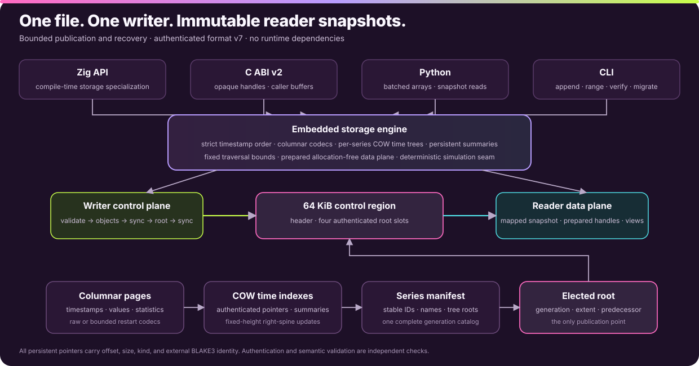
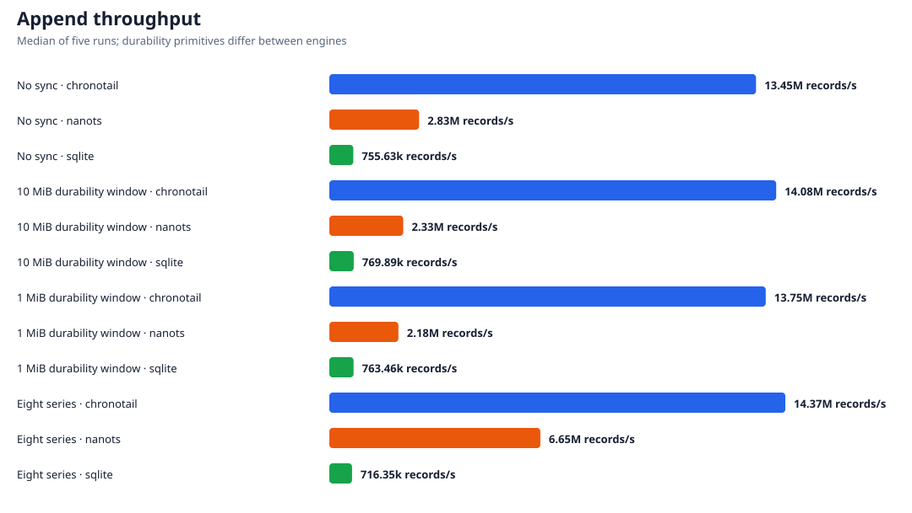
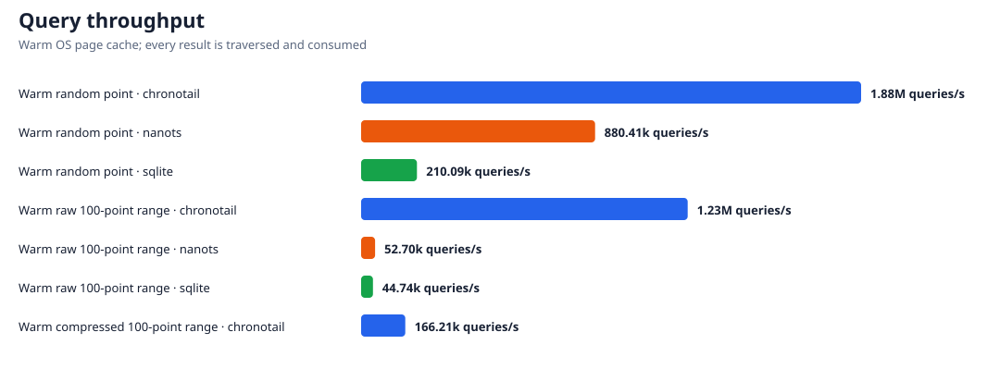
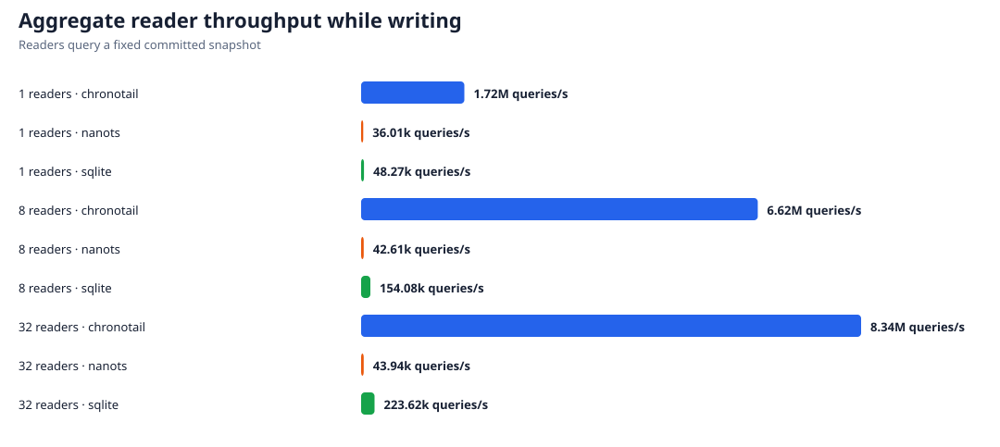
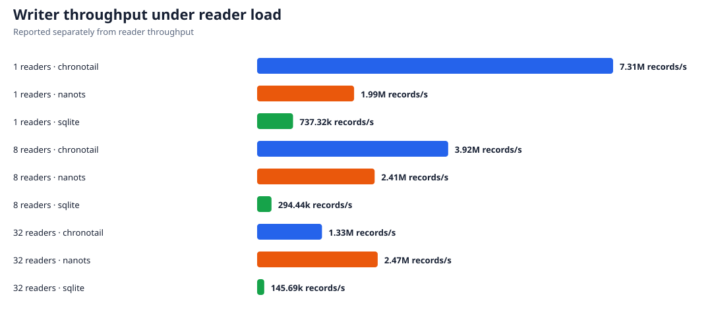
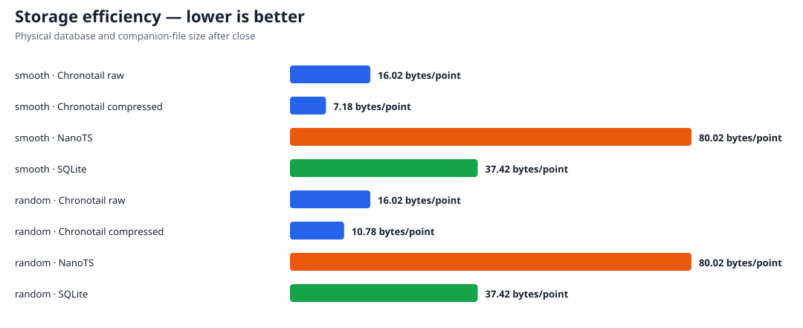

# Chronotail

**A small embedded time-series engine for ordered timestamped data.**

Chronotail stores multiple named series in one portable `.ctdb` file. It has no server, SQL layer, background threads, or runtime dependencies. One writer appends data while readers query immutable committed snapshots.

> **v1.0.0** · file format **v6** · C ABI **v1** · macOS ARM64

<p align="center"></p>

## Why Chronotail

- **Predictable storage:** fixed 64 KiB blocks, append-only checkpoints, bounded recovery.
- **Fast reads:** mmap snapshots, prepared timestamp geometry, raw and compressed ranges.
- **Safe failure model:** checksums, strict timestamp validation, crash recovery, independent verification.
- **Concurrent snapshots:** one writer and any number of readers without reader/writer locking.
- **Small integration surface:** native Zig API, frozen C ABI, Python bindings, and a CLI.
- **Portable database files:** format v6 uses explicit little-endian integer domains and no native structs.

## Install

Download `chronotail-1.0.0-macos-aarch64.tar.gz` from the GitHub release, verify it with the accompanying `SHA256SUMS`, and extract it:

```bash
tar -xzf chronotail-1.0.0-macos-aarch64.tar.gz
export PATH="$PWD/chronotail/bin:$PATH"
```

The archive contains the CLI, `libchronotail.a`, `libchronotail.dylib`, `chronotail.h`, API documentation, and a dependency-free Python wheel.

```bash
python3 -m pip install chronotail/python/*.whl
```

Development requires Zig 0.15.2:

```bash
zig build -Doptimize=ReleaseFast
zig build test
```

## Quick start

```bash
chronotail append metrics.ctdb cpu 1000 42.5
chronotail append metrics.ctdb cpu 1001 43.1
chronotail range metrics.ctdb cpu 0 2000
chronotail verify metrics.ctdb
chronotail inspect metrics.ctdb
```

```text
1000 42.5
1001 43.1
OK: committed state valid
```

Python batches can use `array` for a zero-copy binding path:

```python
from array import array
import chronotail

with chronotail.Writer("metrics.ctdb", codec="compressed") as db:
    db.append("cpu", array("q", [1002, 1003]), array("d", [43.4, 43.8]))
    db.checkpoint(fsync=True)

with chronotail.Reader("metrics.ctdb") as db:
    print(db.range("cpu", 0, 2000))
```

## Performance

The canonical v1 suite contains 225 measurements across Chronotail, NanoTS, and SQLite: 45 workload/engine groups, five repetitions each. All engines receive identical points, public APIs only are timed, results are consumed, and complete databases are validated.

| Workload | Chronotail | vs NanoTS | vs SQLite |
|---|---:|---:|---:|
| Warm random point lookup | 1.88M queries/s | 2.14× | 8.96× |
| Warm raw 100-point range | 1.23M queries/s | 23.32× | 27.47× |
| 32-reader aggregate while writing | 8.34M queries/s | 189.85× | 37.31× |
| Eight-series append | 14.37M records/s | 2.16× | 20.06× |

The benchmark host carried unrelated background load. Same-run competitor ratios are valid; absolute rates are not a clean comparison with older runs. Append durability primitives also differ, so the project does not claim equivalent power-loss semantics across Chronotail `fsync`, NanoTS `msync`, and SQLite WAL FULL. See [BENCHMARKS.md](BENCHMARKS.md) for complete tables, latency distributions, storage results, methodology, and caveats.

### Append throughput

<p align="center"></p>

### Query throughput

<p align="center"></p>

### Concurrent readers

<p align="center"></p>

<p align="center"></p>

### Storage efficiency

<p align="center"></p>

## Durability and snapshots

Chronotail is single-writer/multiple-reader. A checkpoint flushes pending blocks, appends a checksummed footer/trailer generation, and optionally calls `fsync`. A reader sees one immutable committed generation until `refresh()` adopts a newer complete checkpoint. Interrupted writes leave the previous generation readable; recovery scans for the newest valid trailer.

Checksums detect damaged bytes. Verification additionally checks structural bounds, codecs, counts, footer chains, and strict timestamp order. Successful checksum validation is cached only while exact immutable block identity is preserved.

## APIs

- [Zig API](docs/api/zig.md)
- [C ABI v1](docs/api/c.md)
- [Python API](docs/api/python.md)
- [Architecture](docs/architecture.md)
- [Format and machine model](docs/performance/tigerstyle-machine-model.md)
- [Release notes](RELEASE_NOTES.md)

CLI commands:

```text
chronotail append  <file.ctdb> <series> <timestamp> <value> [raw|compressed]
chronotail range   <file.ctdb> <series> <start> <end>
chronotail verify  <file.ctdb>
chronotail inspect <file.ctdb>
```

`append` defaults to adaptive compression. The library APIs provide efficient batch append and caller-owned query buffers.

## Build, test, and release

```bash
zig build test
zig build test -Doptimize=ReleaseSafe
zig build test -Doptimize=ReleaseFast
zig build simulator -Doptimize=ReleaseFast
./tools/benchmark.sh
./scripts/build-release.sh
```

The deterministic simulator injects crashes, short writes, failed writes, truncation, and corruption into the same compile-time-specialized engine used in production. The final v1 campaign executed 100,000,000 operations over 1,000 seeds with zero invariant failures.

The release matrix is declared in `scripts/targets.sh`. Version 1.0.0 intentionally supports only macOS ARM64.

## Scope

Chronotail is deliberately not a distributed database, server, query language, mutable key/value store, or general analytics engine. It is optimized for strictly increasing timestamps, bounded append/checkpoint work, and time-range reads from local files.

## License

[MIT](LICENSE)
