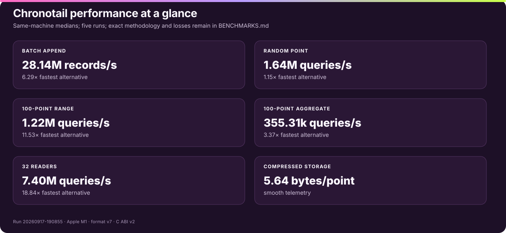
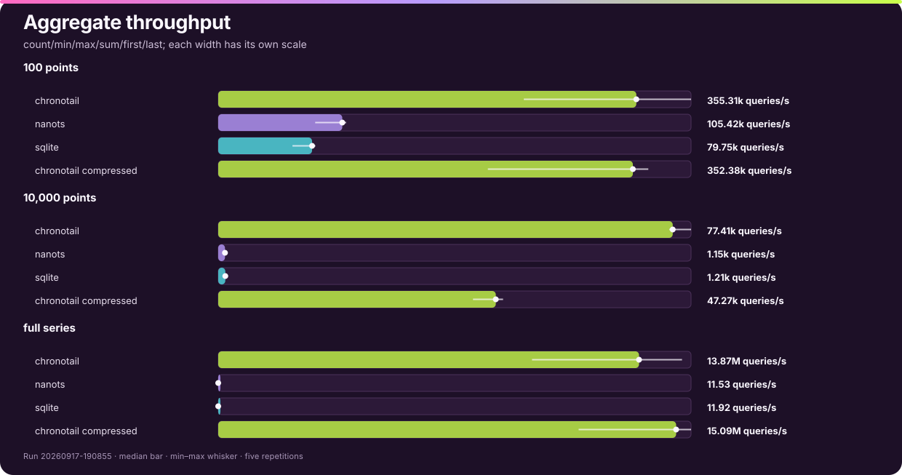

# Chronotail

**A dependency-free embedded time-series engine for strictly ordered data.**

Chronotail stores multiple named series in one portable `.ctdb` file. There is
no server, SQL layer, background thread, or production runtime dependency. One
writer appends while any number of readers query immutable committed snapshots.

> Chronotail 2.0.0 is unreleased. The current source uses file format v7 and C
> ABI v2, and is validated for macOS ARM64 with Zig 0.15.2.


## Why Chronotail

- **Fast, bounded reads:** mmap snapshots, prepared series, persistent cursors,
  borrowed raw pages, and persisted whole-series summaries.
- **Predictable writes:** immutable 64 KiB columnar pages and copy-on-write
  indexes keep the append path allocation-free after open.
- **Explicit durability:** memory publication and disk publication are separate
  choices; disk checkpoints use ordered sync and root publication.
- **Defensive recovery:** four checksummed root slots bound startup work to the
  64 KiB control region, with full structural and semantic validation afterward.
- **Small integration surface:** native Zig, C ABI v2, Python bindings, and a
  command-line interface all exercise the same engine.
- **Portable storage:** format v7 uses explicit little-endian integer domains,
  external BLAKE3 object identities, and no persisted native structs.

## Quick start

Build the command-line tool and libraries:

```bash
zig build -Doptimize=ReleaseFast
```

Append ordered points, query a range, and verify the complete database:

```bash
zig-out/bin/chronotail append metrics.ctdb cpu 1000 42.5
zig-out/bin/chronotail append metrics.ctdb cpu 1001 43.1
zig-out/bin/chronotail range metrics.ctdb cpu 0 2000
zig-out/bin/chronotail verify metrics.ctdb
zig-out/bin/chronotail inspect metrics.ctdb
```

```text
1000 42.5
1001 43.1
OK: committed state valid
```

Python batches accept `array` objects without converting every point to a
Python tuple:

```python
from array import array
import chronotail

with chronotail.Writer("metrics.ctdb", codec="compressed") as db:
    db.append("cpu", array("q", [1002, 1003]), array("d", [43.4, 43.8]))
    db.checkpoint(fsync=True)

with chronotail.Reader("metrics.ctdb") as db:
    print(db.range("cpu", 0, 2000))
```

See the [getting-started guide](docs/getting-started.md) for installation,
complete CLI examples, and first programs in Python and Zig.

## Performance

The current public run contains 495 measurements: 99 engine/workload groups,
five repetitions each. Chronotail, NanoTS, and SQLite were built locally and
measured on the same Apple M1 through public APIs. Every result was consumed,
and every completed database was validated.

| Workload | Chronotail median | vs NanoTS | vs SQLite |
|---|---:|---:|---:|
| Batch append, 4,096 points | 28.14M records/s | 6.29× | 17.36× |
| Warm random point lookup | 1.64M queries/s | 1.15× | 4.44× |
| Warm raw 100-point range | 1.22M queries/s | 11.53× | 12.27× |
| Warm raw 100-point aggregate | 355.31k queries/s | 3.37× | 4.46× |
| 32 readers while writing | 7.40M queries/s | 223.33× | 18.84× |



These are same-run comparisons, not vendor claims. The durability primitives
are not equivalent enough for honest checkpoint multipliers, so the report
shows those latencies without declaring a winner. [BENCHMARKS.md](BENCHMARKS.md)
contains every table, min–max variation, measured-loss analysis, methodology,
caveat, raw record, command log, source fingerprint, and reproduction command.

### Append throughput

Each workload is scaled independently so the three engines remain readable;
the white whisker is the min–max range across five runs.


### Copied-query throughput

Raw rows are the equivalent three-engine comparison. Compressed Chronotail
rows show its storage/CPU tradeoff and are never used for competitor ratios.


### Aggregate throughput

Every engine computes count, minimum, maximum, sum, first, and last over the
same inclusive range through its public API.



### Concurrent readers and writer

Reader and writer rates are shown separately; they are never added into a
combined score.


### Storage efficiency

Physical size includes every persistent database and companion file after the
engine is closed.


## Durability and snapshots

A checkpoint writes immutable data pages, copy-on-write index nodes, and a
manifest before publishing one of four rotating root slots. Disk durability
syncs data before root publication and syncs the published root afterward. A
reader keeps one immutable generation until `refresh()` adopts a newer complete
root; refresh invalidates borrowed views and cursors from the previous snapshot.

Interrupted writes leave an older root readable. External 128-bit BLAKE3
identities detect damaged or misdirected immutable objects, while semantic
verification separately checks bounds, object kinds, index ordering, codecs,
statistics, root succession, and strict timestamp order. Read the
[durability guide](docs/durability.md) for the exact guarantees.

## Compatibility and migration

Chronotail 1.x database format v6 and C ABI v1 remain frozen historical
boundaries. Current code does not open a v6 file as a writable v7 database and
never rewrites it in place. Migration creates and verifies a separate output:

```bash
zig-out/bin/chronotail migrate-v6 old.ctdb new.ctdb
```

Keep the source until the new file has passed application-level acceptance.
The [migration guide](docs/migration.md) covers the compatibility boundary,
capacity planning, validation, and rollback.

## Documentation

- [Documentation index](docs/index.md)
- [Getting started](docs/getting-started.md)
- [Architecture](docs/architecture.md)
- [Durability and recovery](docs/durability.md)
- [Migration](docs/migration.md)
- [Zig API](docs/api/zig.md)
- [C API](docs/api/c.md)
- [Python API](docs/api/python.md)
- [Design rationale](docs/design.md)
- [Internal performance profile](docs/performance/internal-profile.md)
- [Optimization roadmap](docs/performance/optimization-roadmap.md)
- [Competitive benchmark report](BENCHMARKS.md)
- [Release notes](RELEASE_NOTES.md)

The design rationale includes the TigerStyle lessons, the system-wide redesign,
rejected alternatives, accepted tradeoffs, and the intentionally narrow seam
for a future replication layer. Distribution is not part of this release.

## Build and verify

```bash
zig build test
zig build test -Doptimize=ReleaseSafe
zig build test -Doptimize=ReleaseFast
zig build simulator -Doptimize=ReleaseFast
zig build performance -Doptimize=ReleaseFast -- --quick
python3 scripts/check-release.py
```

The deterministic simulator exercises crash, short-write, failed-write,
truncation, corruption, checkpoint, and reopen paths against the same
compile-time-specialized engine used in production. Contributor rules and the
full validation workflow are in [CONTRIBUTING.md](CONTRIBUTING.md).

## Scope

Chronotail is deliberately not a distributed database, server, query language,
mutable key/value store, or general analytics engine. The immutable object
model gives future replication work stable transfer and repair identities; the
current product remains an embedded local engine.

## License

[MIT](LICENSE)
