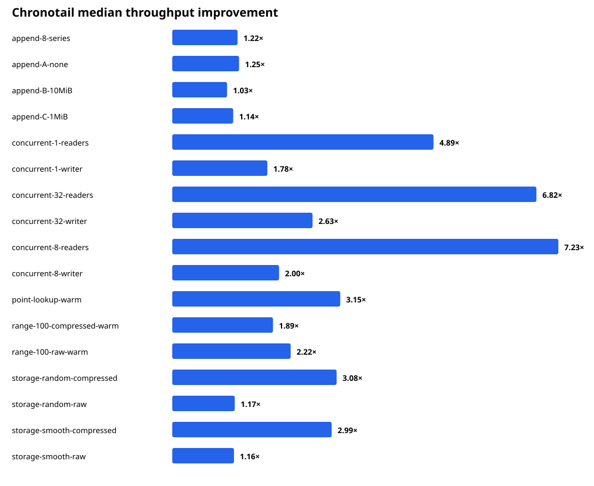

# Chronotail engine performance pass

## Scope and evidence

The immutable baseline is `bench/results/20260916-200732`; the optimized result is `bench/results/20260916-213249`. Both contain the same 225-result matrix: 45 engine/workload groups, five repetitions each. `before-after.csv` contains every Chronotail comparison. Raw profiles, disassembly, focused experiment output, ABI symbols, simulator output, and release smoke output are preserved in this directory.

No file-format, ABI, checksum, durability, recovery, or snapshot rule was relaxed. A deterministic 20,000-point compressed database with four checkpoints produced byte-identical baseline and optimized v6 files (`5d9d523…dc475`).

## Profile findings

### Before

- Raw queries repeatedly decoded and validated the 48-byte block header, then linearly scanned from the beginning of a roughly 4,093-record block. Internal timing attributed about 500ns to cached raw record scanning in a representative 100-point query.
- Readers copied every first-touched block into separately allocated memory. Independent readers therefore duplicated pages and polluted caches.
- Gorilla bit I/O processed every bit in a loop. This dominated compressed decode/encode.
- Unchanged refreshes performed `fstat`, multiple `pread` calls, footer checksum work, and parsing. A 2M-refresh probe took 29.13s.
- Append samples were concentrated in block flushing. Baseline `sample` showed 406/836 samples in `flushSeries`, including 317 in `pwrite`; the hot path also copied every raw block before writing it.
- Checkpoint profiles showed repeated allocator mmap/munmap activity plus separate block/footer `pwrite` calls.

### After

- Raw blocks use binary lower-bound search, then a tight sequential output loop. Cached production reads use a shared read-only mmap and skip already-completed header/checksum work.
- Gorilla uses 128-bit reservoirs, emitting/consuming bytes rather than individual bits. Timestamp and value state advance together.
- Unchanged refresh now performs only `fstat`; final sampling placed 364/365 samples in that unavoidable syscall. The probe fell to 0.79s.
- Writer raw records are accumulated in their final block position; flushing no longer copies a 64KiB payload.
- Footer serialization retains capacity. Final checkpoint sampling no longer showed page-allocation mmap/munmap among dominant stacks; `pwrite` and footer generation remain.
- Generated ARM64 symbols contain no standalone raw scan, range-internal, bit-reader, or compressed-decoder functions: Zig/LLVM folded them into the query caller. `readVarint` remains out of line intentionally because forced inlining regressed compressed throughput 8%.

Full Instruments counters were unavailable: `/usr/bin/xctrace` requires full Xcode, while this host has Command Line Tools only. Accordingly, no instructions/cycle or cache-miss figures are invented.

## Complete before/after Chronotail matrix

| Workload | Before | After | Speedup | p50 before→after | p99 before→after |
|---|---:|---:|---:|---:|---:|
| append-8-series | 13.020M/s | 15.910M/s | 1.22x | 0.042→0.042µs | 0.084→0.084µs |
| append-A-none | 21.438M/s | 26.834M/s | 1.25x | 0.041→<0.041µs | 0.083→0.042µs |
| append-B-10MiB | 23.352M/s | 23.984M/s | 1.03x | 0.041→<0.041µs | 0.042→0.042µs |
| append-C-1MiB | 21.601M/s | 24.643M/s | 1.14x | 0.041→<0.041µs | 0.042→0.042µs |
| concurrent-1 reader | 0.474M queries/s | 2.321M | 4.89x | 1.875→0.333µs | 4.417→1.042µs |
| concurrent-1 writer | 8.241M records/s | 14.678M | 1.78x | — | — |
| concurrent-8 readers | 1.161M queries/s | 8.393M | 7.23x | 2.917→0.375µs | 8.208→1.334µs |
| concurrent-8 writer | 4.113M records/s | 8.227M | 2.00x | — | — |
| concurrent-32 readers | 1.263M queries/s | 8.614M | 6.82x | 3.583→0.375µs | 10.625→1.333µs |
| concurrent-32 writer | 3.006M records/s | 7.898M | 2.63x | — | — |
| point lookup | 0.853M/s | 2.682M/s | 3.15x | 0.916→0.125µs | 2.000→0.541µs |
| compressed 100-point range | 0.174M/s | 0.329M/s | 1.89x | 5.584→2.875µs | 7.916→4.084µs |
| raw 100-point range | 0.783M/s | 1.737M/s | 2.22x | 1.000→0.292µs | 2.167→0.958µs |
| random compressed append | 7.245M/s | 22.294M/s | 3.08x | 0.041→<0.041µs | 0.042→0.042µs |
| random raw append | 24.503M/s | 28.667M/s | 1.17x | 0.041→0.041µs | 0.042→0.042µs |
| smooth compressed append | 7.521M/s | 22.454M/s | 2.99x | 0.041→<0.041µs | 0.042→0.042µs |
| smooth raw append | 23.881M/s | 27.591M/s | 1.16x | 0.041→<0.041µs | 0.042→0.042µs |

Values reported as zero by the harness are below its clock resolution, not literally zero.

## Updated competitive ratios

Append durability ratios are observations only, not claims that `fsync`, NanoTS `msync`, and SQLite WAL persistence primitives are identical.

| Workload | vs NanoTS | vs SQLite |
|---|---:|---:|
| append A | 5.07x | 16.38x |
| append B / 10MiB | 5.47x | 14.64x |
| append C / 1MiB | 6.18x | 15.58x |
| eight-series append | 1.76x | 10.79x |
| point lookup | 1.87x | 7.16x |
| raw 100-point range | 16.50x | 17.85x |
| 1-reader writer | 5.70x | 9.85x |
| 1-reader aggregate queries | 24.40x | 23.43x |
| 8-reader writer | 3.19x | 8.71x |
| 8-reader aggregate queries | 129.48x | 31.51x |
| 32-reader writer | 3.08x | 15.97x |
| 32-reader aggregate queries | 160.29x | 24.24x |

Storage sizes and compression ratios are byte-for-byte unchanged.

## Regressions and tradeoffs

- No workload in the final competitive matrix regressed in median throughput.
- Production reader open/reopen increased in a separate checkpoint probe from about 0.210ms median to about 0.290ms because readers establish an mmap. Query setup is excluded from competitive timing. This is the explicit cost of shared zero-copy pages.
- Compressed range remains 5.28x slower than raw range. The format requires decoding from a 128-record checkpoint and maintaining timestamp and Gorilla value state; optimizing the reservoir reduced but cannot eliminate that work.
- Durable append B improved only 3%. At that cadence persistence latency dominates CPU improvements.
- The mmap path is compile-time-selected only for `std.fs.File`; simulator storage remains statically specialized and unchanged.

## Remaining bottlenecks

1. **Append/checkpoint:** checksumming and `pwrite` dominate full-block flushes; strict checkpoints add filesystem sync latency. FNV-1a's byte-serial dependency prevents straightforward SIMD while preserving v6 bytes.
2. **Compressed queries:** variable-length timestamp varints and stateful XOR decoding are inherently sequential between 128-record checkpoints. `readVarint` remains visible in about 6% of compressed samples.
3. **Refresh:** unchanged refresh is now one `fstat`. Removing it would require shared process metadata or weaker visibility semantics.
4. **Concurrency:** readers no longer duplicate block pages, but continuously busy readers still compete for cores and shared cache/memory bandwidth. There are no engine locks or shared engine atomics in the read path.
5. **Cold first access:** checksum verification remains intentionally expensive and unchanged. Warm queries reuse verification state; checksums were not weakened.

## Correctness evidence

- Unit/integration tests, including mapped refresh: passed.
- Deterministic 1,000-seed simulator: 100,000,000 operations, 916 crashes, 815 short writes, 794 failed writes, 5,989 truncations, 5,961 corruptions, 59,114 checkpoint/reopens, **0 invariant failures**.
- v6 deterministic baseline/current fixture: byte-identical SHA-256.
- C ABI v1 exports: all nine expected `ct_*` symbols, unchanged.
- Artifact-only release smoke test: passed.
