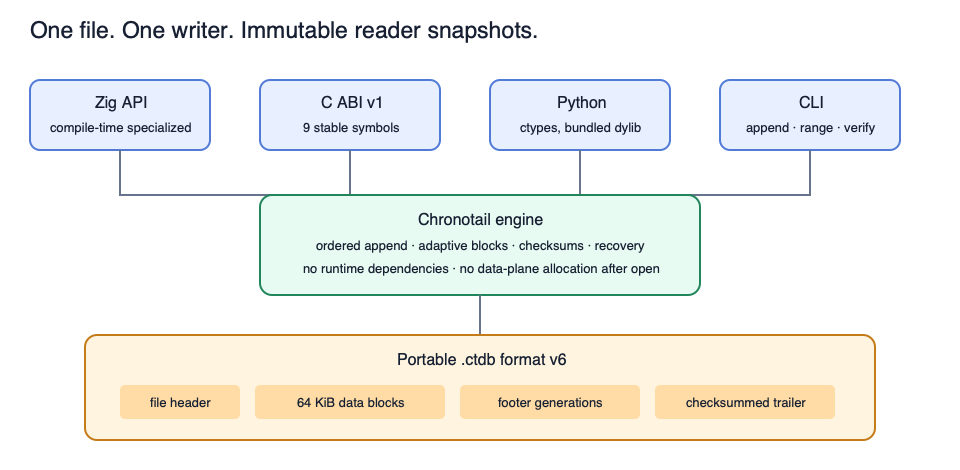

# Architecture

Chronotail separates stable boundaries from replaceable internals:

- `src/chronotail.zig` is the frozen public Zig facade.
- `src/internal/engine.zig` owns format v6 and engine implementation.
- `src/cli.zig` is presentation only.
- `src/c_api.zig` owns C ABI v1 translation and opaque handles.
- `sim/` runs the same generic engine against deterministic memory storage.
- `tests/`, `bench/`, `scripts/`, and `tools/` isolate correctness, measurement, release, and profiling concerns.

The engine uses compile-time file specialization. Production resolves to `std.fs.File`; simulation resolves to its deterministic backend. There is no runtime storage dispatch in production.

## Control plane and data plane

The data plane consists of append, batch append, block selection, raw range decoding, and compressed decoding. Existing-series appends and production mapped-reader queries perform no heap allocation. The data plane consumes metadata prepared by open, refresh, series creation, block verification, and checkpointing.

The control plane owns file recovery, footer-chain reconstruction, catalog allocation, series creation, mmap replacement, checkpoint serialization, and verification transitions. Footer-chain reconstruction uses a fixed 64-entry stack array, matching format v6's snapshot cadence. Catalog capacities are reserved from validated footer counts before entries are parsed.

Writer and reader series are distinct compile-time types:

- Writer series contain hot append metadata and a stable pointer to one 64 KiB block buffer.
- Reader series contain immutable block metadata, a separate cold verification array, and prepared timestamp-search geometry.
- The query-hot block index is 40 bytes. Cached bytes, verification state, and the proven raw timestamp step live outside it.

This split prevents readers from allocating or moving writer-only 64 KiB buffers. A series object fell from 65,624 bytes in the shared representation to 96 bytes in both specialized representations.

## Prepared timestamp geometry

Strictly increasing timestamps permit stronger indexing than generic binary search:

1. Open/refresh examines authenticated footer metadata. If full blocks have one consistent timestamp step and stride, block selection uses an arithmetic estimate.
2. The estimate is accepted only when neighboring block bounds prove it correct; otherwise lookup uses binary search.
3. On first raw-block access, checksum verification also proves every interior timestamp is increasing and detects a fixed step.
4. A proven fixed-step block maps a timestamp directly to its lower-bound record. Irregular blocks retain binary search.

The arithmetic paths are correctness-neutral. They are enabled only by proofs, and every metadata estimate remains guarded by bounds. Refresh transfers verification state only when the complete block identity is unchanged. This relies on format v6's committed-prefix immutability under Chronotail's single-writer protocol.

Release targets are data in `scripts/targets.sh`. Version 1.0.0 supports macOS ARM64 only. A future architecture requires a target tuple, shared-library name, and wheel platform tag rather than copied build logic; support is declared only after native artifact validation.
